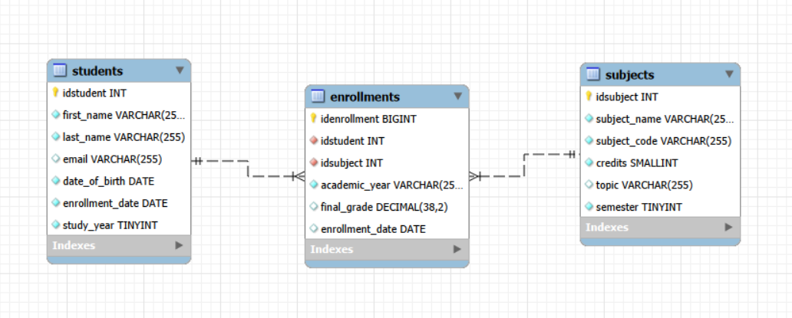
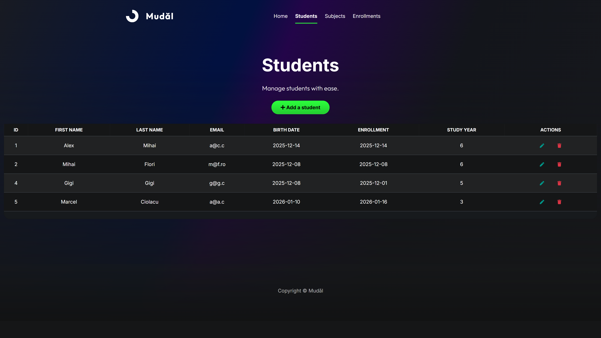
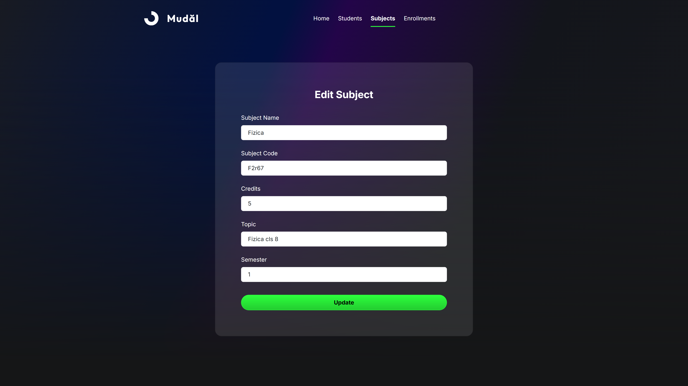
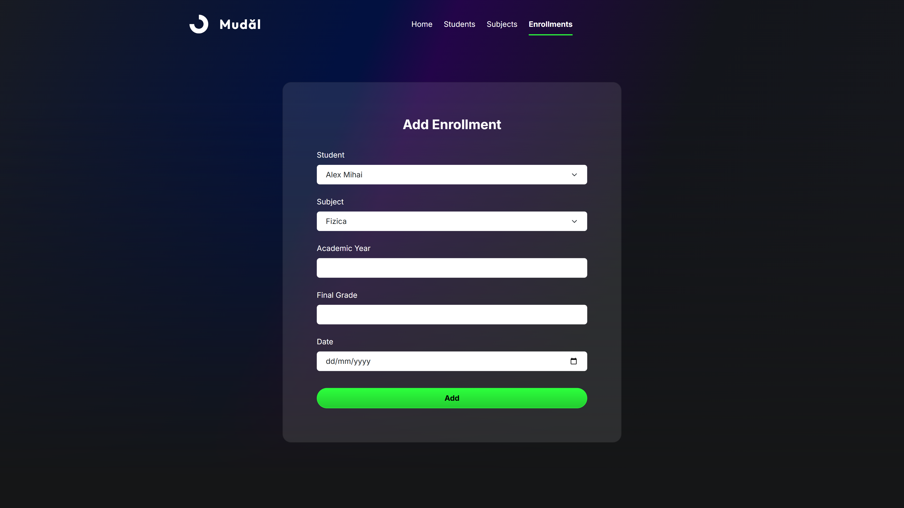

# University Management — Spring Boot

## Descriere
Aplicație web pentru gestionarea unei baze de date universitare (**students / subjects / enrollments**).  
Backend-ul este realizat în **Spring Boot**, iar interfața a fost construită în **Bootstrap Studio** și integrată cu aplicația prin request-uri către endpoint-uri (CRUD).
În **docs/** se regăsește documentația proiectului în care se regăsesc mai multe detalii tehnice.

> Context: proiect realizat în cadrul unei discipline de la facultate.  
> Notă: am primit un schelet pentru partea de backend (structură + setup inițial). Contribuția mea a fost în principal pe **frontend (Bootstrap Studio)**, integrarea cu endpoint-urile, ajustări și integrarea finală a aplicației.

## Funcționalități
- operații CRUD pentru Studenți / Materii / Înscrieri
- UI responsive (Bootstrap)
- persistare în MySQL (JPA/Hibernate)

## Tehnologii
- Java 25
- Spring Boot, Spring Data JPA, Hibernate
- Maven
- MySQL
- HTML / CSS / Bootstrap (Bootstrap Studio)

## Baza de date
Această aplicație folosește baza de date MySQL: `university`.  
Există și o implementare separată a aceleiași aplicații folosind **JSP/Servlets**, pe aceeași bază de date (într-un repo separat).

## Diagrama bazei de date

## Capturi de ecran (UI)

## Rulare locală

### Cerințe
- Java 25
- Maven
- MySQL

### Configurare DB (important)
În repo nu există credențiale reale.

1. Copiază:
   - `src/main/resources/application.properties.example`
   - în `src/main/resources/application.properties`
2. Completează user/parola și URL-ul DB-ului local.

### Import DB (opțional)
Dacă vrei să rulezi proiectul rapid, poți importa baza de date din dump-ul MySQL care se regăsește în **db/university.sql**.
